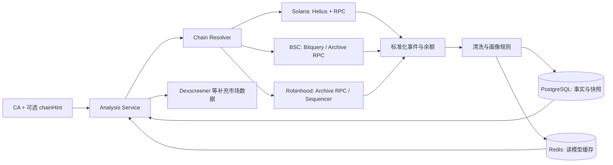

# Memecoin CA 分析系统：Data Layer v0.1

## 1. 整体数据层架构说明

技术选型采用 TypeScript。理由不是“开发快”这么简单：Solana 官方生态、Helius SDK、EVM SDK 都以 JS/TS 支持最完整；规则会高频迭代，TypeScript 的判别联合类型很适合表达链、事件、排除原因和置信度；同一服务可以用 `bigint` 保留链上原始整数，避免金额计算经过浮点数。吞吐真正成为瓶颈后，Yellowstone 消费器可单独用 Go/Rust 重写，不需要推翻领域模型。



分层原则：

- 链上事实层：原始整数余额、标准化 trade/transfer、funding edge、创建事件。可重放、幂等写入。
- 规则层：真实持仓、同源集群、Dev 行为、钱包标签。均为纯函数并带 `rule_version`。
- 读模型层：将一次分析结果物化为 JSONB，并放入 Redis。Quick Analysis 命中缓存只做一次读取。
- 补充数据层：Dexscreener/GeckoTerminal 只补价格、FDV、流动性和 pair，不作为 creator、持仓或卖出事实来源。

Quick Analysis 的冷请求先取 token，再并行取市场、holder、近期交易和 transfer；holder 返回后再并行补标签和 funding。建议目标为缓存命中 p95 < 100ms，冷请求 p95 1.5–3s。Deep Analysis 扩大历史窗口并计算创建者历史，可同步 5–20s 或后续改成 job + 轮询。

Solana 第一阶段使用 Helius Enhanced Transaction/Webhook 加官方 RPC 交叉校验；Webhook 必须按 signature + event index 幂等，因为提供方会重试。Pump.fun 使用官方 program/IDL 解码 `create/buy/sell/migrate`；创建指令中的 `creator` 才是首选创建者，不能总把 payer/user 当 creator。后续低延迟增量消费再接 Yellowstone。

BSC 与 Robinhood 共用 EVM 标准化器，但 launchpad factory/ABI 注册表分开。Robinhood Chain 是 EVM/Arbitrum L2，主网 chain id 为 4663；公共 RPC 有限流，不适合作生产历史索引，历史查询应使用 archive provider。Sequencer feed 适合低延迟增量，不替代 canonical RPC 回补和确认。

## 2. 核心数据模型

完整 DDL 在 `db/migrations/001_initial.sql`。核心关系如下：

| 表 | 作用 | 关键口径 |
|---|---|---|
| `tokens` | Token 基础信息 | `(chain, ca)` 唯一，保存 creator 证据和 launchpad |
| `token_markets` | Bonding curve / LP / canonical pair | 明确 infrastructure 地址，供 holder 排除 |
| `normalized_trades` | 跨链统一买卖事实 | `(chain, tx_hash, event_index)` 幂等；全部金额存 raw integer |
| `token_transfers` | Token 流转 | transfer 不自动等于 sell |
| `holder_snapshots` | 每个块高点的清洗结果 | 保存 real Top10/20、排除占比和规则版本 |
| `holder_snapshot_balances` | 快照逐地址明细 | 原始余额、owner、clean rank、排除原因、cluster id |
| `funding_edges` | 原生 gas 资金边 | 支持 recipient/funder + 时间倒排查询 |
| `address_clusters` / `members` | 简单同源集群 | token 级、证据 JSON、置信度、规则版本 |
| `dev_behavior_snapshots` | Dev 行为读模型 | 当前仓位、gross sold、net disposed、关联钱包分别存 |
| `large_orders` | 大单和钱包质量标签 | 分类结果、分数、原因、规则版本 |
| `creator_profiles` / `creator_launches` | 创建者历史画像 | token 数、毕业数、最高 FDV、数据完整度 |
| `address_labels` | 白/黑名单与系统地址库 | 来源、置信度、有效期，不覆盖历史事实 |
| `analysis_runs` | 抓取可观测性 | source watermark、partial warning、错误 |
| `analysis_materializations` | Quick/Deep 读取物化 | 正规化表仍为 source of truth |

TypeScript 领域接口位于 `src/domain/types.ts`。所有链上数量先存 `bigint` / PostgreSQL `numeric(78,0)`；只有最终百分比和 USD 补充值使用 number/numeric。

## 3. 关键业务逻辑

### 真实 Top Holder 清洗

实现见 `src/domain/rules/real-holders.ts` 与 `funding-clusters.ts`。

```text
1. 取得足够大的 holder 候选集（建议 Top100 或全量），不可只取原始 Top20。
2. Solana 先把多个 token account/ATA 聚合到 owner；EVM 直接按 address。
3. 从 launchpad PDA/factory、canonical pair、LP、burn/system registry 得到排除标签。
4. 对候选地址查询首次 funding 和首次买入：
   同一 funder -> 新地址 -> funding 后 10 分钟内买入 -> 兄弟地址 2 分钟内同步买入。
5. 只有 cluster confidence >= 0.85 才排除；低置信仅展示风险提示。
6. 在剩余地址上重新排序，计算 Clean Top10 / Top20。
7. 同时返回 raw row、exclusion reason、cluster evidence、excluded_pct。
```

当前置信度规则为基础版：0.75 + 0.05 × 成员数，上限 0.99。生产中还应增加“资金源是否 CEX 热钱包”的否决条件；否则大量正常用户从同一交易所提币会误聚类。若 funder 是已知交易所，不能只凭同源判定，需要同时命中极短时间、相近金额、钱包新鲜度和同步买入。

### Dev 累计已卖出

实现见 `src/domain/rules/dev-behavior.ts`。

```text
creator := launchpad create/factory event 中的 creator（metadata/deployer 只作回退）
direct_balance := 当前 creator owner 的所有 token accounts 之和
gross_bought := creator 作为 trader 的所有 buy token amount
gross_sold := creator 作为 trader 的所有 sell token amount
net_disposed := max(gross_sold - gross_bought, 0)
gross_sold_pct := gross_sold / total_supply
sold_of_acquired_pct := gross_sold / gross_bought

related := creator 直接 funding 的一级钱包（基础版）
related holding / related sold 单独输出，不与 creator 本人混合
creator -> related 的 token transfer 只是内部搬仓，不算卖出
creator -> 未知地址的 transfer 记 outbound_transfer，继续追踪，不冒充已卖出
```

为何保留两个卖出口径：反复买卖会使 `gross_sold` 超过最初仓位；`net_disposed` 表示扣除回购后的净处置。对 Pump.fun，创建者可能通过首次买入建仓，而不是创建时直接获配，所以不能用“初始 mint 分配 - 当前余额”推算卖出。

### 大单质量

Quick 阶段默认把最近 30 分钟、USD 名义价值至少 5,000 的 trade 标成大单。阈值应进一步支持 `max(固定 USD, 流动性比例, 近期成交额分位数)`。钱包分类的优先级为黑名单 > 白名单 > 疑似 Bot > 新/历史钱包；每个标签保留 reasons，禁止只保存一个不可解释的分数。

## 4. 推荐目录结构

```text
src/
  application/
    analysis-service.ts       # Quick / Deep / Refresh 编排
    ports.ts                  # 数据源、仓储、缓存边界
  domain/
    types.ts                  # 统一领域模型
    rules/
      real-holders.ts
      funding-clusters.ts
      dev-behavior.ts
      wallet-quality.ts
  infrastructure/
    cache/
    postgres/
    solana/                   # 下一步：Helius/RPC/Pump decoder
    evm/                      # 下一步：BSC/Robinhood log decoder
    market/                   # 下一步：Dexscreener 补充源
db/
  migrations/
test/
docs/
```

不要按链复制三套业务规则。链适配器只负责把不同格式转成 `NormalizedTrade`、`TokenTransfer`、`HolderBalance` 和 `FundingEdge`；清洗规则完全复用。

## 5. 第一阶段核心 Service 和方法

已经提供的上层稳定接口：

- `AnalysisService.getQuickAnalysis(ca, { chainHint? })`
- `AnalysisService.getDeepAnalysis(ca, { chainHint? })`
- `AnalysisService.refreshTokenData(ca, { chainHint? })`

第一阶段按优先级实现真实适配器：

1. `TokenResolverService.resolve(ca, chainHint?)`：Solana 地址格式直判；`0x` 地址并行 probe BSC/Robinhood，多链同时存在时要求 chainHint。
2. `SolanaDataAdapter`：token/create 解析、holder owner 聚合、Pump.fun trade、transfer、funding、钱包历史。
3. `PumpFunDecoder`：官方 program ID + IDL 版本化解码 create/buy/sell/migrate，识别 bonding curve PDA 和 PumpSwap pool。
4. `HolderSnapshotService.refresh(token)`：至少抓 Top100，打系统/LP/cluster 标签，保存 raw + clean snapshot。
5. `DevBehaviorService.refresh(token)`：从创建到当前全历史聚合，增量 watermark 后只扫新 slot。
6. `LargeOrderService.refresh(token, window)`：链上 quote 金额定价，批量获取钱包 facts，分类并落库。
7. `CreatorProfileService.refresh(creator)`：反查 create/factory event；峰值 FDV 为采样值，必须附 completeness。
8. `MarketEnrichmentService.getMarket(token)`：Dexscreener 主补充、GeckoTerminal 回退；不覆盖链上事实。
9. `BscDataAdapter` + `FourMemeDecoder`：第二优先级，Bitquery subscription 或 archive logs。
10. `RobinhoodDataAdapter` + launchpad decoder registry：第三优先级，先 RPC/log 回补，后接 sequencer 增量。

## 6. 需要注意的坑和优化点

- Solana `getTokenLargestAccounts` 只拿很小的头部集合时，排除 curve/LP/cluster 后可能不足 20 个；抓取必须过量。一个 owner 也可能有多个 token account，必须 owner 聚合。
- 不能把 token transfer 当 sell。Sell 必须来自 DEX/launchpad 指令语义、池子净流或可验证 swap；转到关联钱包是搬仓。
- Pump.fun `create` 的 `user` 与 `creator` 可能不同；免费创建/首买流程尤其容易误判。IDL/program 升级时 decoder 要按 program + discriminator + version 管理。
- EVM contract address 跨链不唯一。仅传 CA 时 BSC/Robinhood 都要 probe；若两条链都存在必须要求 chainHint，不能猜。
- Fee-on-transfer、rebase、Token-2022 transfer fee 会破坏简单的 event amount = 实收量假设。第一阶段先标 `unsupported_token_mechanics`，不要输出伪精确值。
- Funding 集群最危险的误报是 CEX 出金、桥和批量钱包服务。已知 exchange/bridge/router 必须进入 deny-as-funder 规则；高置信才从 Top Holder 中剔除。
- 使用 confirmed/processed 做低延迟提示时，必须在 finalized 后回补；保存 slot/block watermark，处理 Solana fork 与 EVM reorg。
- Helius webhook/Bitquery subscription 都可能重试、乱序或断流。数据库唯一键保证幂等，并用定时 reconcile 对 RPC 重扫最近窗口。
- Decimal 只用于展示，计算全程 raw integer。USD 价值附带价格来源和时间戳，不能用“当前价”回填历史大单。
- Dexscreener 的 pair/price/FDV 是补充源且有限流；做请求合并、30–60 秒缓存和 stale-while-revalidate。市场源失败时仍返回链上分析并带 warning。
- 创建者最高 FDV 若没有持续采样，只能叫 observed peak FDV；输出 `data_completeness`，禁止把不完整历史包装成精确统计。
- 第一阶段用 PostgreSQL 邻接表足够；查询 funding 只做 1–2 跳且严格时间窗口。暂时不引入图数据库。

## 数据源依据

- Dexscreener API：token pair 查询可批量，公开文档给出相应 rate limit，适合作缓存后的市场补充。
- Helius Enhanced Transactions 提供可读 transaction history；Webhook 存在重试和重复投递可能，所以必须幂等。
- Pump.fun 官方公开文档给出 program、create/buy/sell/migrate 语义，并明确 `user` 与 `creator` 可能不同。
- Robinhood 官方文档说明其为 EVM/Arbitrum L2、chain id 4663、公共 RPC 受限，并提供 sequencer feed。
