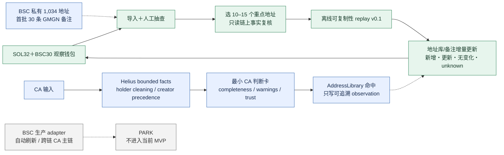
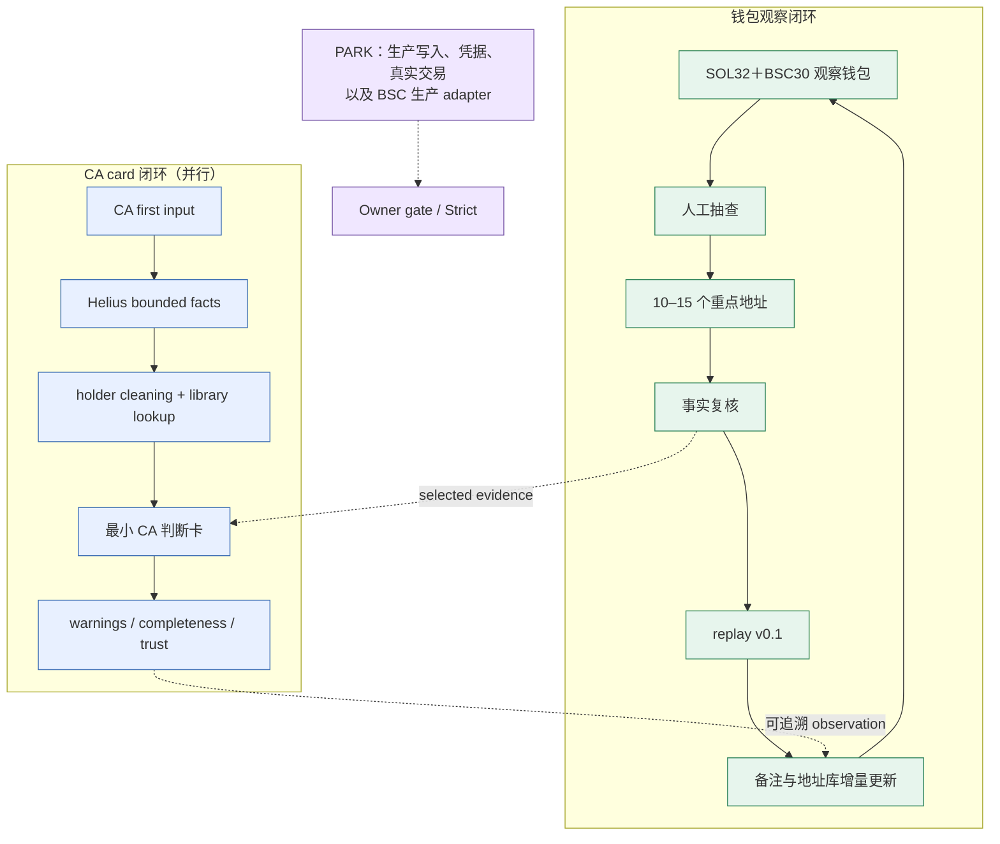
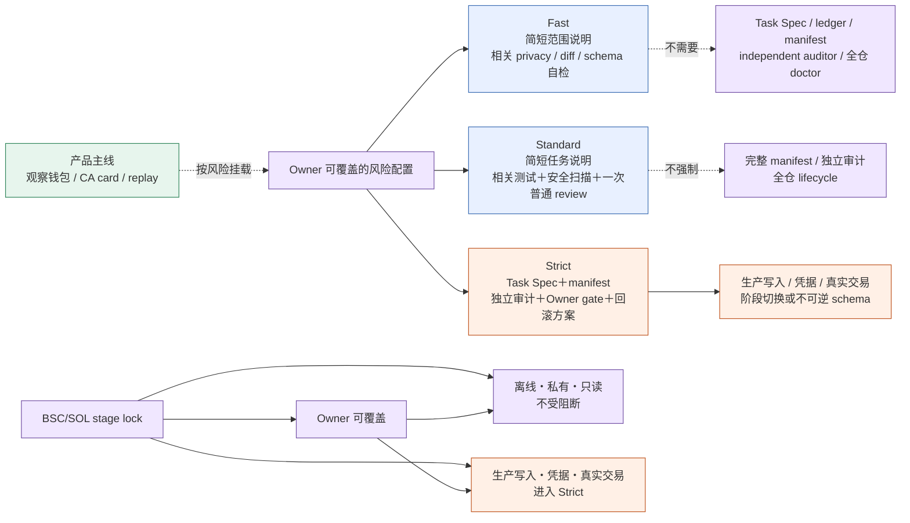
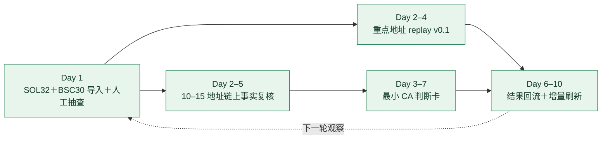

# PROJECT MAINLINE RESET DIAGRAMS 2026-08-05

用途：把 Owner 直接授权后的 7–10 天并行 MVP 画成最小可读的产品视图。主线从已有的 SOL32＋BSC30 观察钱包和人工抽查开始；私有、离线、只读观察与生产 adapter 分开。所有 borrowed 字段仍保持 unverified，Harness 作为风险 sidecar，不是用户价值链的替代物。

## 主线与观察闭环

这条闭环的顺序是：观察钱包 → 选定复核 → replay → note/library 更新 → 下一轮观察。BSC 私有观察作为 KEEP / USE_NOW 进入同一观察入口；BSC 生产 adapter、自动刷新和跨链 CA 主链不因私有产物而解除 PARK。

## CA 卡与钱包闭环并行

CA card 和钱包观察不是串行门槛：前者提供可解释的 CA 判断与地址库命中，后者提供选样本、事实复核和 replay 反馈；两者通过 scrubbed structured observation 互相补充。

## Lean Harness sidecar

Lean Harness 只把不可逆和高风险动作放进 Strict。T2 标签不再自动推出独立 Auditor；FAIL 形成有界 finding/review decision，不自动创建 repair 链。旧 reports、dispatches、ledger 和 evidence 先只读归档，归档前不逐文件开启 repair。

## 7–10 天并行 MVP 时间线

明确后置：BSC 生产 adapter、自动刷新、跨链 CA 生产主链、Robinhood、Live Shadow Trading、signing/broadcast/copy-trade CTA、宏观 Dune、自动 discovery/cron、生产 PostgreSQL/Redis 和竞品/社交接入。该时间线是 7–10 天并行 MVP。
