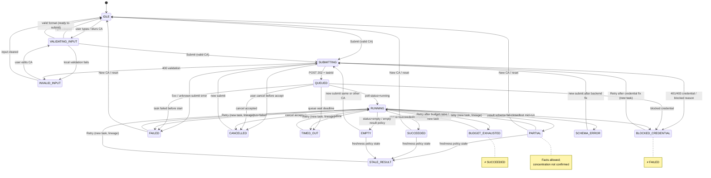

# Operator Console UI State Machine V1

**Document:** `OPERATOR_CONSOLE_UI_STATE_MACHINE_V1`  
**Scope:** Operator Console — CA input → task lifecycle → result presentation  
**Audience:** Frontend implementers, API designers, auditors  
**Related:**

- `docs/contracts/OPERATOR_CONSOLE_DATA_SOURCE_V1.md`
- `docs/contracts/CA_SCAN_RESPONSE_V1.md`
- `docs/product/OPERATOR_CONSOLE_COMPONENT_CONTRACTS_V1.md`
- `docs/product/OPERATOR_CONSOLE_API_UI_GAP_MATRIX_V1.md`
- Shell: `apps/operator-console` (fixture mode; Live not wired)

## Purpose

Define the **full client UI state machine** for a single CA analysis flow, from empty form through validation, submit, queue, run, terminal outcomes, and stale/schema failures.

This machine is **presentation law**. Backend remains the authority for:

- task `status`
- field `verificationStatus`
- `warnings[]`
- `evidence` / evidence refs
- `ruleVersion`
- `observedAt`
- `sourceWatermark`

The UI **must not** invent status, recompute ratios, promote Tier-B → confirmed, or treat `ratio: null` as `0%`.

---

## Hard rules (non-negotiable)

| # | Rule | UI implication |
|---|------|----------------|
| H1 | **Credential blocked ≠ generic failed** | `BLOCKED_CREDENTIAL` has its own badge, copy, actions, and log class. Never collapse into `FAILED`. |
| H2 | **Budget exhausted ≠ complete** | `BUDGET_EXHAUSTED` is terminal incomplete. Do not show green “完成 / Succeeded”. Partial facts may remain visible only if backend marks them partial-safe. |
| H3 | **PARTIAL may show facts but not confirmed concentration** | Display raw/partial tables + warnings. Concentration cells stay **不可确认 / not confirmable** unless backend `verificationStatus === "confirmed"` **and** concentration gate is eligible. |
| H4 | **Schema unknown → fail-closed** | `SCHEMA_ERROR` (or unknown schema/version) blocks rendering of judgment sections. No best-effort parse of undeclared fields. |
| H5 | **Retry preserves lineage** | Retry always creates a **new** `taskId` with `parentTaskId` / `lineageRootId` (or equivalent) set by API. UI shows lineage, never overwrites prior run rows. |
| H6 | **Stale not disguised as latest** | `STALE_RESULT` must show `StaleBanner` + watermark/observedAt. Never badge as “最新 / Latest”. |
| H7 | **Empty ≠ error** | `EMPTY` is a valid terminal for “no holders / no hits / no labels”. Use empty state, not error chrome. |
| H8 | **`ratio = null` → 不可确认, not 0%** | `formatRatio(null) === "暂不可确认"` (EN: “Not confirmable”). Never `"0%"`, never invent precision. |

---

## Canonical UI states

```text
IDLE
VALIDATING_INPUT
INVALID_INPUT
SUBMITTING
QUEUED
RUNNING
PARTIAL
SUCCEEDED
FAILED
BLOCKED_CREDENTIAL
BUDGET_EXHAUSTED
TIMED_OUT
STALE_RESULT
SCHEMA_ERROR
CANCELLED
EMPTY
```

### Grouping (for layout only)

| Group | States | Layout pattern |
|-------|--------|----------------|
| Input | `IDLE`, `VALIDATING_INPUT`, `INVALID_INPUT` | CA form + local validation |
| In-flight | `SUBMITTING`, `QUEUED`, `RUNNING` | TaskLifecycle + BudgetMeter + spinner/progress |
| Terminal OK-ish | `SUCCEEDED`, `PARTIAL`, `EMPTY` | Result panels (gated by verification) |
| Terminal blocked | `BLOCKED_CREDENTIAL`, `BUDGET_EXHAUSTED` | Dedicated blocked/budget chrome |
| Terminal fail | `FAILED`, `TIMED_OUT`, `SCHEMA_ERROR`, `CANCELLED` | Error / cancelled panels |
| Result quality | `STALE_RESULT` | Overlay banner on otherwise renderable payload |

`STALE_RESULT` may **overlay** a previously loaded payload (or a result that is still structurally valid but marked stale by policy). It is both a machine state and a presentation flag; see state table.

---

## API status mapping (contract-level)

Backend / DTO task status vocabulary may be lower_snake or lower-case enums. UI maps **only** via explicit tables — no fuzzy string match.

### Task resource status → UI state

| API `task.status` (target) | API detail / reason codes | UI state |
|----------------------------|---------------------------|----------|
| *(none — form only)* | — | `IDLE` / `VALIDATING_INPUT` / `INVALID_INPUT` |
| *(POST accepted, body not yet)* | HTTP 202 in flight | `SUBMITTING` |
| `queued` | — | `QUEUED` |
| `running` | — | `RUNNING` |
| `partial` | warnings present; completeness partial | `PARTIAL` |
| `succeeded` / `completed` / `ok` | completeness complete; no fatal | `SUCCEEDED` |
| `failed` | generic / provider / validation (not credential) | `FAILED` |
| `blocked` | `failureReason` / warning ∈ {`credential_unavailable`, `credential_blocked`, `missing_credential`} | **`BLOCKED_CREDENTIAL`** |
| `budget_exhausted` | or `failed` + reason `request_budget_exhausted` | **`BUDGET_EXHAUSTED`** |
| `timed_out` | or `failed` + reason `timeout` / `deadline_exceeded` | `TIMED_OUT` |
| `cancelled` | — | `CANCELLED` |
| `empty` | or `succeeded` + result empty flag / zero holders by policy | `EMPTY` |
| *(any)* + result `freshness === "stale"` / watermark policy | stale policy hit | `STALE_RESULT` (overlay) |
| *(any)* + schema mismatch / unknown version | parse fail-closed | `SCHEMA_ERROR` |

**Shell today (`TaskViewModel.status`):**  
`queued | running | completed | partial | failed | blocked` — see gap matrix. Map:

| Shell fixture status | UI state |
|----------------------|----------|
| `queued` | `QUEUED` |
| `running` | `RUNNING` |
| `completed` | `SUCCEEDED` (fixture only; still show fixture watermark) |
| `partial` | `PARTIAL` |
| `failed` | `FAILED` (unless reason is credential → `BLOCKED_CREDENTIAL`) |
| `blocked` + `credential_unavailable` | `BLOCKED_CREDENTIAL` |

### Result resource status → UI

| Result field | Effect |
|--------------|--------|
| `status: "OK"` / complete | Contributes to `SUCCEEDED` when task terminal OK |
| `status: "PARTIAL"` / `completeness.overall === "partial"` | `PARTIAL` |
| `status: "REJECTED"` | Prefer `FAILED` or `SCHEMA_ERROR` depending on reason |
| `schema` unknown / version unsupported | `SCHEMA_ERROR` |
| all sections empty + policy empty | `EMPTY` |
| `observedAt` / watermark older than freshness policy | `STALE_RESULT` |

---

## Mermaid state diagram



---

## Per-state contract

Legend for action columns:

- **Allowed** = controls UI may enable  
- **Forbidden** = must be disabled / hidden / no-op  
- **Retry allowed?** = whether Retry CTA is shown  
- **Retry creates new run?** = always **yes** when retry is allowed (lineage preserved)  
- **Human review required?** = from backend `whetherManualReviewRequired` / issues; UI only surfaces flag  
- **Log/evidence entry** = required operator-visible log line class

---

### 1. `IDLE`

| Field | Value |
|-------|--------|
| **Trigger** | Initial mount; form reset; user clears CA; navigation to CA analyze entry with no active task |
| **API status mapping** | No task. Optional: none |
| **Page title** | `CA 分析 · 输入` / `CA Analyze · Input` |
| **User copy (ZH)** | 输入 Solana mint（CA）后提交分析。当前阶段可能仅为 fixture，不发起 Live 请求。 |
| **User copy (EN)** | Enter a Solana mint (CA) and submit. Shell may be fixture-only with no Live calls. |
| **Badge** | none or `IDLE` (muted) |
| **Show partial data?** | No |
| **Allowed actions** | Edit CA; Validate on blur/type; Submit when local-valid; Open history/list |
| **Forbidden actions** | Poll task; Open EvidenceDrawer for nonexistent task; Claim Live |
| **Retry allowed?** | No |
| **Retry creates new run?** | N/A |
| **Human review required?** | No |
| **Log/evidence entry** | `ui.idle` — session start / form ready |

---

### 2. `VALIDATING_INPUT`

| Field | Value |
|-------|--------|
| **Trigger** | User edits CA; debounced local format check (base58 length/charset heuristics only) |
| **API status mapping** | No task |
| **Page title** | `CA 分析 · 校验输入` / `CA Analyze · Validating input` |
| **User copy (ZH)** | 正在校验地址格式… |
| **User copy (EN)** | Checking address format… |
| **Badge** | `VALIDATING` (muted/spinner) |
| **Show partial data?** | No |
| **Allowed actions** | Continue editing; Cancel clear |
| **Forbidden actions** | Submit while format still pending (optional debounce lock); Treat as on-chain existence check |
| **Retry allowed?** | No |
| **Retry creates new run?** | N/A |
| **Human review required?** | No |
| **Log/evidence entry** | `ui.validate.start` / `ui.validate.pass` |

**Note:** Local validation is **format-only**. Existence, mint truth, and accounting are backend-only.

---

### 3. `INVALID_INPUT`

| Field | Value |
|-------|--------|
| **Trigger** | Local format fail **or** API 400 `invalid_mint` / `invalid_ca` on submit |
| **API status mapping** | HTTP 400 validation; or client-side invalid before POST |
| **Page title** | `CA 分析 · 输入无效` / `CA Analyze · Invalid input` |
| **User copy (ZH)** | CA 格式无效，请检查 mint 后重试。此状态不是分析失败。 |
| **User copy (EN)** | Invalid CA format. Fix the mint and try again. This is not an analysis failure. |
| **Badge** | `INVALID` (bad/muted) |
| **Show partial data?** | No |
| **Allowed actions** | Edit CA; Clear; Submit again after fix |
| **Forbidden actions** | Map to `FAILED`; Show concentration tables; Retry as “rerun analysis” without fix |
| **Retry allowed?** | No (use re-submit after edit) |
| **Retry creates new run?** | N/A |
| **Human review required?** | No |
| **Log/evidence entry** | `ui.input.invalid` + reason code |

---

### 4. `SUBMITTING`

| Field | Value |
|-------|--------|
| **Trigger** | User clicks Submit; POST `/api/v1/ca-holder-tasks` (target) or demo create (shell) in flight |
| **API status mapping** | HTTP request outstanding; no durable `taskId` yet (or optimistic local id only) |
| **Page title** | `CA 分析 · 提交中` / `CA Analyze · Submitting` |
| **User copy (ZH)** | 正在提交任务… |
| **User copy (EN)** | Submitting task… |
| **Badge** | `SUBMITTING` (warn/spinner) |
| **Show partial data?** | No |
| **Allowed actions** | Cancel (if client can abort before accept); Navigate away with abandon warning |
| **Forbidden actions** | Double-submit; Poll; Open result panels as Live |
| **Retry allowed?** | No until terminal or network fail |
| **Retry creates new run?** | N/A |
| **Human review required?** | No |
| **Log/evidence entry** | `task.submit.start` → `task.submit.accepted` / `task.submit.error` |

---

### 5. `QUEUED`

| Field | Value |
|-------|--------|
| **Trigger** | POST returns `taskId` + `status: queued` |
| **API status mapping** | `task.status = queued` |
| **Page title** | `任务排队中 · {shortMint}` / `Task queued · {shortMint}` |
| **User copy (ZH)** | 任务已入队，等待执行。预算尚未消耗或为 0。 |
| **User copy (EN)** | Task is queued. Budget not yet consumed (or still 0). |
| **Badge** | `QUEUED` (warn) |
| **Show partial data?** | No |
| **Allowed actions** | Poll/subscribe; Cancel (if API supports); Open task id copy; Navigate to Tasks list |
| **Forbidden actions** | Show concentration as confirmed; Fabricate progress % beyond API fields |
| **Retry allowed?** | No |
| **Retry creates new run?** | N/A |
| **Human review required?** | No |
| **Log/evidence entry** | `task.queued` + `taskId`, `mint`, `requestBudget` |

---

### 6. `RUNNING`

| Field | Value |
|-------|--------|
| **Trigger** | Poll/event: `status = running` |
| **API status mapping** | `task.status = running` |
| **Page title** | `分析进行中 · {shortMint}` / `Running · {shortMint}` |
| **User copy (ZH)** | 正在拉取与清洗持仓… 请关注请求预算。部分中间结果若下发，仅作过程观察，不可当作最终确认。 |
| **User copy (EN)** | Fetching and cleaning holders… Watch request budget. Intermediate facts are observational only. |
| **Badge** | `RUNNING` (warn/spinner) |
| **Show partial data?** | **Yes only if** API streams partial payload and marks sections partial; still **no confirmed concentration** |
| **Allowed actions** | Poll; Cancel; Open partial Evidence if refs exist; View budget meter |
| **Forbidden actions** | Promote intermediate ratios to confirmed; Hide budget; Suppress warnings |
| **Retry allowed?** | No (wait for terminal) |
| **Retry creates new run?** | N/A |
| **Human review required?** | Only if backend already flags an issue mid-run (rare) |
| **Log/evidence entry** | `task.running` + `requestsUsed/requestBudget`, optional phase |

---

### 7. `PARTIAL`

| Field | Value |
|-------|--------|
| **Trigger** | Terminal or stable `status = partial` (e.g. pagination incomplete, section unavailable) |
| **API status mapping** | `task.status = partial` and/or result `completeness.overall = partial` / `status = PARTIAL` |
| **Page title** | `部分结果 · {shortMint}` / `Partial result · {shortMint}` |
| **User copy (ZH)** | 结果不完整。可展示已有事实与告警，但 **不得** 将集中度标为已确认。`ratio` 为 null 时显示「暂不可确认」，不是 0%。 |
| **User copy (EN)** | Incomplete result. Facts and warnings may show; concentration is **not** confirmed. Null ratios → “Not confirmable”, never 0%. |
| **Badge** | `PARTIAL` (warn) |
| **Show partial data?** | **Yes** — holder universes, accounting rows, warnings, evidence refs as provided |
| **Allowed actions** | View tables; Open EvidenceDrawer; Retry (new run); Copy taskId; Export allowlisted fields |
| **Forbidden actions** | Green “分析完成”; Confirmed concentration badge; Treat as `SUCCEEDED` |
| **Retry allowed?** | **Yes** |
| **Retry creates new run?** | **Yes** — new `taskId`, preserve `parentTaskId` / lineage |
| **Human review required?** | If any issue has `whetherManualReviewRequired: true` → surface **人工复核** banner |
| **Log/evidence entry** | `task.partial` + warning codes + completeness + watermark |

**PARTIAL concentration rule (H3):**

```text
IF concentrationEligible !== true OR verificationStatus !== "confirmed"
  THEN display "暂不可确认" / "Not confirmable"
  NEVER show as confirmed investor concentration
```

---

### 8. `SUCCEEDED`

| Field | Value |
|-------|--------|
| **Trigger** | Terminal success with complete policy pass |
| **API status mapping** | `task.status ∈ {succeeded, completed, ok}` **and** not empty **and** not stale **and** schema ok |
| **Page title** | `分析完成 · {shortMint}` / `Succeeded · {shortMint}` |
| **User copy (ZH)** | 任务完成。请仍按字段级 verification / accounting / exclusion / concentration 门闩阅读，勿把整页当作单一“确认”标签。 |
| **User copy (EN)** | Task finished. Read field-level verification and split gates; the page is not a single global “confirmed” stamp. |
| **Badge** | `SUCCEEDED` / `COMPLETED` (ok) — **task** badge only |
| **Show partial data?** | N/A (full allowed sections); null fields still use null rules |
| **Allowed actions** | Full result navigation; Evidence; Retry (new observation run); Compare lineage |
| **Forbidden actions** | Override Tier-B to confirmed in UI; Hide residual/warnings if present |
| **Retry allowed?** | Yes (new run / refresh observation) |
| **Retry creates new run?** | **Yes** |
| **Human review required?** | Only if backend flags issues despite task success |
| **Log/evidence entry** | `task.succeeded` + `observedAt` + `sourceWatermark` + `ruleVersion` |

**Important:** Task `SUCCEEDED` does **not** force concentration `CONFIRMED`. Shell fixtures already show `concentrationEligible: false` with OK-ish status.

---

### 9. `FAILED`

| Field | Value |
|-------|--------|
| **Trigger** | Terminal failure that is **not** credential-blocked, budget, timeout, schema, or cancel |
| **API status mapping** | `task.status = failed` with reason ∉ credential/budget/timeout set |
| **Page title** | `分析失败 · {shortMint}` / `Failed · {shortMint}` |
| **User copy (ZH)** | 分析失败：{failureReason}。这不是凭证阻断，也不是预算耗尽。 |
| **User copy (EN)** | Analysis failed: {failureReason}. Not a credential block and not budget exhaustion. |
| **Badge** | `FAILED` (bad) |
| **Show partial data?** | Only if API returns safe partial artifact; default **No** |
| **Allowed actions** | Retry (new run); Edit CA; Open failure evidence/log; Copy taskId |
| **Forbidden actions** | Relabel as `BLOCKED_CREDENTIAL` or `BUDGET_EXHAUSTED`; Fake success |
| **Retry allowed?** | **Yes** (unless reason is permanent invalid already mapped to `INVALID_INPUT`) |
| **Retry creates new run?** | **Yes** |
| **Human review required?** | If backend says so |
| **Log/evidence entry** | `task.failed` + reason code + evidence refs |

---

### 10. `BLOCKED_CREDENTIAL`

| Field | Value |
|-------|--------|
| **Trigger** | Credential missing/unavailable/forbidden for provider path |
| **API status mapping** | `status = blocked` **or** failed/blocked with `failureReason` / warnings ∈ credential set |
| **Page title** | `凭证阻断 · 无法执行` / `Credential blocked` |
| **User copy (ZH)** | **凭证不可用，任务被阻断。** 这不是通用失败，也不是分析结果。请由运维配置凭证后重新发起（新任务，保留谱系）。 |
| **User copy (EN)** | **Credential unavailable — task blocked.** This is not a generic failure and not an analysis result. Fix credentials, then submit a new task (lineage preserved). |
| **Badge** | `BLOCKED · CREDENTIAL` (bad, distinct icon/text from FAILED) |
| **Show partial data?** | No (unless API explicitly returns pre-block snapshot — rare; still not confirmed) |
| **Allowed actions** | Open runbook link (no secrets); Copy taskId; After fix → Retry/new submit; Contact ops |
| **Forbidden actions** | Show as `FAILED`; Retry loops without credential remediation messaging; Display secrets |
| **Retry allowed?** | **Yes**, only after user acknowledges credential fix (new run) |
| **Retry creates new run?** | **Yes** |
| **Human review required?** | Ops / owner — not data judgment review |
| **Log/evidence entry** | `task.blocked.credential` — **never** log key material |

---

### 11. `BUDGET_EXHAUSTED`

| Field | Value |
|-------|--------|
| **Trigger** | Request budget fully consumed before complete result policy |
| **API status mapping** | `status = budget_exhausted` **or** failed + `request_budget_exhausted` **or** `requestsUsed >= requestBudget` with incomplete terminal |
| **Page title** | `预算耗尽 · 未完成` / `Budget exhausted · Incomplete` |
| **User copy (ZH)** | **请求预算已耗尽，任务未完成。** 这不等于成功完成。已产生的部分事实若存在，仅作观察；集中度不可确认。 |
| **User copy (EN)** | **Request budget exhausted; task incomplete.** This is not success. Any emitted facts are observational; concentration not confirmable. |
| **Badge** | `BUDGET EXHAUSTED` (bad/warn — **not** green complete) |
| **Show partial data?** | **Yes if** backend attached partial payload; apply PARTIAL concentration rules |
| **Allowed actions** | View partial; Evidence; Retry with new budget policy (new task); Raise budget (ops) |
| **Forbidden actions** | Badge as `SUCCEEDED` / “完成”; Hide budget meter; Claim complete universe |
| **Retry allowed?** | **Yes** (new run; may need higher budget) |
| **Retry creates new run?** | **Yes** |
| **Human review required?** | Optional if partial quality issues flag it |
| **Log/evidence entry** | `task.budget_exhausted` + `requestsUsed/requestBudget` |

---

### 12. `TIMED_OUT`

| Field | Value |
|-------|--------|
| **Trigger** | Deadline exceeded (queue or run) |
| **API status mapping** | `status = timed_out` or failed + `timeout` / `deadline_exceeded` |
| **Page title** | `任务超时` / `Timed out` |
| **User copy (ZH)** | 任务超时。可重试（新 run，保留谱系）。超时不等于凭证问题。 |
| **User copy (EN)** | Task timed out. Retry creates a new run with lineage. Timeout ≠ credential block. |
| **Badge** | `TIMED OUT` (bad) |
| **Show partial data?** | Only if API returns last safe snapshot |
| **Allowed actions** | Retry; View partial snapshot; Copy taskId |
| **Forbidden actions** | Infinite silent retry; Map to credential blocked |
| **Retry allowed?** | **Yes** |
| **Retry creates new run?** | **Yes** |
| **Human review required?** | No by default |
| **Log/evidence entry** | `task.timed_out` + phase |

---

### 13. `STALE_RESULT`

| Field | Value |
|-------|--------|
| **Trigger** | Result payload valid but freshness policy marks stale (or watermark older than allowed) |
| **API status mapping** | Task may be succeeded/partial; `freshness_status = stale` **or** UI policy on `observedAt` / `sourceWatermark` |
| **Page title** | `结果已过期 · {shortMint}` / `Stale result · {shortMint}` |
| **User copy (ZH)** | **此结果已过期，不是最新观察。** 下方数据仅供历史对照；请刷新/重跑获取新任务结果。 |
| **User copy (EN)** | **This result is stale — not the latest observation.** Data below is historical context only; refresh/rerun for a new task. |
| **Badge** | `STALE` (warn) — **never** `LATEST` |
| **Show partial data?** | Yes — underlying payload with `StaleBanner` always visible |
| **Allowed actions** | View historical; Compare; Retry/refresh (new run); Open evidence |
| **Forbidden actions** | Hide stale banner; Label as latest; Auto-promote to live without new task |
| **Retry allowed?** | **Yes** (preferred) |
| **Retry creates new run?** | **Yes** |
| **Human review required?** | No by default |
| **Log/evidence entry** | `result.stale` + `observedAt` + `sourceWatermark` |

---

### 14. `SCHEMA_ERROR`

| Field | Value |
|-------|--------|
| **Trigger** | Unknown `schema` / unsupported `version` / validation fail-closed / undeclared fields rejected |
| **API status mapping** | Parse/validate failure; or `schema_error` status |
| **Page title** | `协议错误 · 拒绝渲染` / `Schema error · Fail-closed` |
| **User copy (ZH)** | 响应 schema/version 不可识别或未通过校验。**失败关闭：不渲染判断结果。** 请升级客户端或修复后端契约。 |
| **User copy (EN)** | Response schema/version unknown or failed validation. **Fail-closed: do not render judgment.** Upgrade client or fix backend contract. |
| **Badge** | `SCHEMA ERROR` (bad) |
| **Show partial data?** | **No** judgment tables. Optional: raw allowlisted meta (`taskId`, HTTP code) only |
| **Allowed actions** | Copy error id; Open support/runbook; New submit after fix |
| **Forbidden actions** | Best-effort render of unknown fields; Strip provenance to force display |
| **Retry allowed?** | Yes (usually futile until contract fixed); still new task if attempted |
| **Retry creates new run?** | **Yes** if retry offered |
| **Human review required?** | Engineering review |
| **Log/evidence entry** | `result.schema_error` + schema/version + issue codes (no raw secrets) |

---

### 15. `CANCELLED`

| Field | Value |
|-------|--------|
| **Trigger** | User or system cancel accepted |
| **API status mapping** | `status = cancelled` |
| **Page title** | `任务已取消` / `Cancelled` |
| **User copy (ZH)** | 任务已取消。可重新提交（新任务）。 |
| **User copy (EN)** | Task cancelled. Submit again as a new task. |
| **Badge** | `CANCELLED` (muted) |
| **Show partial data?** | Only if API keeps pre-cancel snapshot |
| **Allowed actions** | New submit; View cancel reason; Copy taskId |
| **Forbidden actions** | Count as success; Silent resume same taskId as running without API |
| **Retry allowed?** | As “new submit” — **yes** |
| **Retry creates new run?** | **Yes** |
| **Human review required?** | No |
| **Log/evidence entry** | `task.cancelled` |

---

### 16. `EMPTY`

| Field | Value |
|-------|--------|
| **Trigger** | Successful empty universe / no holders / no address hits per backend empty policy |
| **API status mapping** | `status = empty` **or** succeeded + empty result flag / zero rows with explicit empty |
| **Page title** | `无数据 · {shortMint}` / `Empty · {shortMint}` |
| **User copy (ZH)** | **没有可展示的数据。** 这不是错误。若预期应有持仓，请检查 mint 或发起新观察。 |
| **User copy (EN)** | **Nothing to show.** This is not an error. If holders were expected, verify mint or start a new observation. |
| **Badge** | `EMPTY` (muted) — **not** `FAILED` |
| **Show partial data?** | EmptyState component; meta (mint, observedAt) ok |
| **Allowed actions** | New CA; Retry observation; Open related tasks |
| **Forbidden actions** | Error toast as failure; Invent 0% concentration as “empty success metric” |
| **Retry allowed?** | Yes |
| **Retry creates new run?** | **Yes** |
| **Human review required?** | No by default |
| **Log/evidence entry** | `result.empty` + empty reason code |

---

## Cross-cutting UI behaviors

### Polling

| State | Poll? |
|-------|-------|
| `SUBMITTING` | No (wait POST) |
| `QUEUED`, `RUNNING` | Yes |
| Terminal states | No (unless user enables “watch for updates” product feature — out of V1 scope) |
| `STALE_RESULT` | No automatic; user-driven refresh |

### Retry lineage (H5)

```text
POST create task {
  mint,
  parentTaskId?: previousTaskId,
  lineageRootId?: rootId ?? previousTaskId
}
```

UI list must show:

- current `taskId`
- `parentTaskId` (if any)
- link to prior run result (if any)

**Never** PATCH old task into a new lifecycle as if it were the same run.

### Ratio display (H8)

| Backend | UI string ZH | UI string EN |
|---------|--------------|--------------|
| `ratio: number` + confirmed eligible | formatted percent | same |
| `ratio: number` + unverified | percent **with** UNVERIFIED badge + “观察值” | percent + UNVERIFIED + “observational” |
| `ratio: null` | **暂不可确认** | **Not confirmable** |
| missing metric object | — / UNAVAILABLE | — / UNAVAILABLE |

### Trust gates (display only; values from backend)

| Gate | Confirmed only when backend says |
|------|----------------------------------|
| Accounting | `accountingEligible === true` (+ completeness) |
| Exclusion | `exclusionCoverage === "complete"` |
| Concentration | `concentrationEligible === true` **and** metric `verificationStatus === "confirmed"` |

`judgmentEligible` (deprecated alias of accounting) must **not** drive concentration.

### Fixture vs Live indicator

Every page must show `FixtureLiveIndicator` from `getDataSourceMeta()`:

- fixture: “Fixture / scrubbed · Live 未接入”
- http not configured: “not_configured”
- live: only when backend meta says live **and** Owner gate allows

---

## State × component visibility (summary)

| State | TaskLifecycle | BudgetMeter | PartialBanner | StaleBanner | BlockedState | EmptyState | SchemaErrorBoundary | Result tables |
|-------|---------------|-------------|---------------|-------------|--------------|------------|---------------------|---------------|
| IDLE | optional | no | no | no | no | no | no | no |
| VALIDATING_INPUT | no | no | no | no | no | no | no | no |
| INVALID_INPUT | no | no | no | no | no | no | no | no |
| SUBMITTING | yes | yes (0/budget) | no | no | no | no | no | no |
| QUEUED | yes | yes | no | no | no | no | no | no |
| RUNNING | yes | yes | if stream | no | no | no | no | partial-safe only |
| PARTIAL | yes terminal | yes | **yes** | if stale | no | no | no | **yes** gated |
| SUCCEEDED | yes terminal | yes | no | if stale | no | no | no | yes gated |
| FAILED | yes terminal | yes | no | no | no | no | no | optional |
| BLOCKED_CREDENTIAL | yes | optional | no | no | **yes** | no | no | no |
| BUDGET_EXHAUSTED | yes | **yes emphasis** | if partial | no | no | no | no | partial-safe |
| TIMED_OUT | yes | yes | if partial | no | no | no | no | optional |
| STALE_RESULT | yes | yes | if partial | **yes** | no | no | no | yes + banner |
| SCHEMA_ERROR | yes | optional | no | no | no | no | **yes** | **blocked** |
| CANCELLED | yes | yes | no | no | no | no | no | optional |
| EMPTY | yes | yes | no | if stale | no | **yes** | no | empty |

---

## Minimal event log schema (UI-side)

```ts
interface UiLifecycleLogEntry {
  at: string; // ISO client clock for UI events; prefer server observedAt when about data
  taskId?: string;
  parentTaskId?: string;
  mint?: string;
  uiState: string;
  apiStatus?: string;
  code: string; // e.g. task.partial
  warnings?: string[];
  evidenceRefs?: string[];
  requestBudget?: number;
  requestsUsed?: number;
  observedAt?: string;
  sourceWatermark?: string;
  ruleVersion?: string;
}
```

No secrets, no raw provider payloads, no credential values.

---

## Acceptance checks (state machine)

1. Credential block never uses `FAILED` badge/copy alone.  
2. Budget exhausted never uses success chrome.  
3. PARTIAL never confirms concentration client-side.  
4. Unknown schema never renders judgment sections.  
5. Retry always allocates new `taskId` and shows lineage.  
6. Stale always shows non-latest banner.  
7. EMPTY uses empty chrome, not error.  
8. `ratio: null` never displays as `0%`.  

---

## Out of scope

- Implementing Live HTTP in Shell  
- Backend worker scheduling internals  
- BSC / non-Solana CA  
- LLM narrative judgment  

## Document control

| Version | Date | Notes |
|---------|------|-------|
| v1 | 2026-07-31 | Initial UI lifecycle law for Operator Console CA flow |
