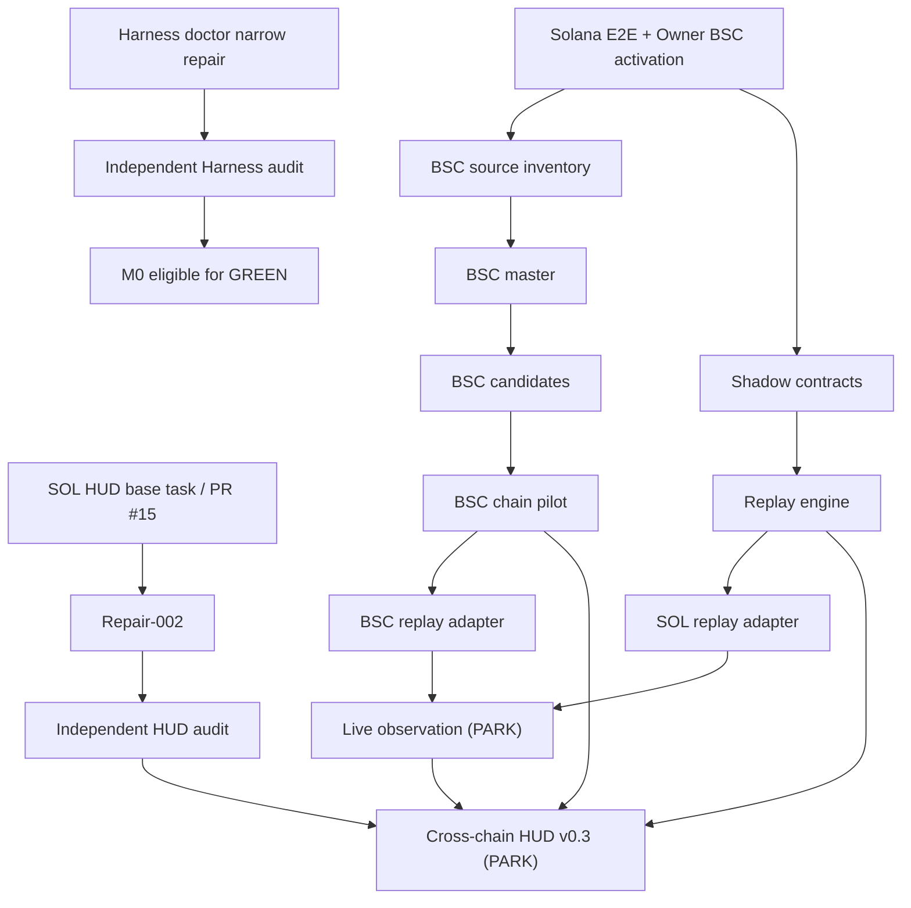

# Cross-chain Wallet Intelligence and Shadow Trading v0.1

## Status as of 2026-08-01

This is a governance-only program dispatch. It does not activate BSC or cross-chain implementation. The repository configuration declares `solana-pumpfun-e2e` as the active stage and lists BSC as blocked. `PROJECT_CONSTITUTION.md`, `harness/config/project.json`, and `OWNER_DECISIONS_NEEDED.md` therefore override any immediate BSC start request. BSC tasks are registered as `BLOCKED_STAGE`; cross-chain contracts and later capabilities remain dependency- or Owner-gated.

## Verified baseline

- `origin/main`: `f5ee5c25d62dde270e1ff055cfd61f36100f5de5`.
- The existing SOL HUD task was present but omitted from the task ledger; this governance PR restores only its ledger registration so Repair-002 has a real dependency.\n- Open SOL HUD PR: #15, branch `feat/sol-wallet-hud-v0-2-scene-strength`, head `6d76a947b38dcd1d5f6c101812ed8aa10f5414c6`; it has no recorded independent GREEN audit and must not be merged by an agent.
- Existing desensitized SOL HUD evidence reports 1,433 master rows, 32 candidates, 5 chain-sampled wallets, and 0 shadow events.
- Private-root aggregate availability was verified for both `sol` and `bsc`; no private records were placed in Git.
- Baseline typecheck, test, build, security scan, and diff check passed on the PR #15 worktree. Harness doctor did not pass because its broad `wallet*.json` prohibited-name rule matched three tracked desensitized fixture/artifact files. This is a separate Harness-quality blocker, not waived by this program.

## Dependency graph

## Phased acceptance matrix

| Milestone | Acceptance boundary | Current state |
|---|---|---|
| M0 Program Harness | Valid specs, acyclic graph, non-overlapping new write sets, governance-only diff, and independently audited doctor repair | PARK; the narrow repair and audit are registered but not yet authorized |
| M1 SOL HUD v0.2 | Repair-002 plus independent GREEN audit on PR #15 | BLOCKED_DEPENDENCY |
| M2 BSC master | Owner BSC activation, inventory, deterministic clean/replay | BLOCKED_STAGE |
| M3 BSC candidates/chain pilot | Explainable candidates and positive/risk/counterexample validation | BLOCKED_STAGE |
| M4 Shadow replay | Contracts and deterministic no-lookahead engine independently audited | BLOCKED_DEPENDENCY |
| M5 Chain replay pilots | Per-chain adapter reports; small samples remain DATA_INSUFFICIENT | BLOCKED_DEPENDENCY / BLOCKED_STAGE |
| M6 Cross-chain HUD | Separate dimensions and a valid shadow-event batch | PARK |

## Write-set governance

The program registers one feature PR per implementation task. SOL and BSC replay adapters have separate source, CLI, test, documentation, report, and artifact directories. Audits are report-only and must be performed by an agent distinct from the corresponding implementer. Repair-002 is the sole serialized continuation of the existing HUD task and works on PR #15 rather than replacing it.

## Planned branches and PRs

1. `chore/crosschain-wallet-shadow-program-spec` — governance only; current draft.
2. `fix/harness-doctor-forbidden-path-rule-repair-001` — narrow Harness gate repair after governance merge; independent audit required.
3. `fix/sol-wallet-hud-v0-2-repair-002` — only after its task is READY; applies commits to the existing PR #15 branch as required by the repair policy.
4. `feat/bsc-wallet-source-inventory-v0-1` and later BSC branches — only after BSC stage activation.
5. `feat/wallet-shadow-trade-contracts-v0-1`, `feat/wallet-shadow-replay-engine-v0-1`, and distinct SOL/BSC adapter branches — only after dependencies and Owner gates permit.

No agent may merge any PR. A GREEN independent audit is necessary before an Owner may merge using a merge commit.
