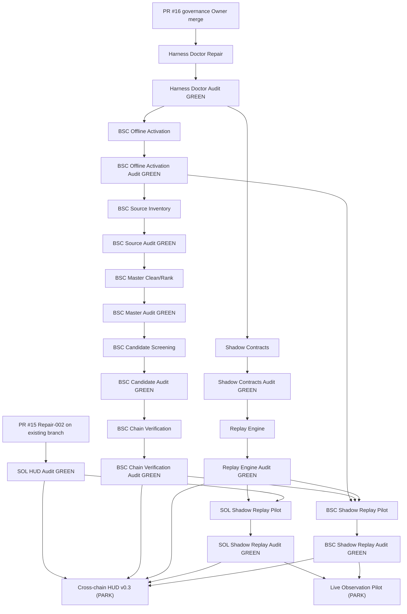

# Cross-chain Wallet Intelligence and Shadow Trading v0.1

## Governance state — 2026-08-02

- **Draft PR #16** remains governance-only: no product source, active-stage configuration, private records, provider configuration, or runtime credentials are changed here.
- The Program registers **27 task-v1 specifications**: 14 implementer/coordinator tasks and 13 independent auditor tasks. `harness/tasks/*.json` is the sole task-status source of truth; the ledger and DAG are synchronized from it.
- **Solana remains the only Live/production delivery chain.** BSC is not activated by this PR. The separate `BSC-OFFLINE-RESEARCH-STAGE-ACTIVATION-001` task is the only authorized path to offline-local-research activation, subject to independent GREEN audit and an Owner merge commit.
- BSC offline scope, only after that future activation: source inventory, master cleaning, candidate screening, local chain verification, and historical replay. BSC network collection, Live providers, resident listeners, GMGN automation, real trades, and production database writes remain prohibited. Robinhood remains `BLOCKED_STAGE`.
- BSC Source Inventory has **only** `BSC-OFFLINE-RESEARCH-STAGE-ACTIVATION-001-AUDIT-001` as its Task Spec dependency; it has no Solana E2E dependency. It remains `BLOCKED_STAGE` until the independently audited, Owner-merged activation actually changes the stage configuration.
- Fetched repository state remains authoritative: current `origin/main` and `harness/config/project.json` do not record an Owner-merged BSC activation implementation, so this governance PR does not claim that such a merge has occurred.
- Chain-neutral shadow contracts, the offline replay engine, and the SOL replay adapter are not blocked by BSC stage activation.
- Existing SOL HUD work remains **PR #15** on `feat/sol-wallet-hud-v0-2-scene-strength`. Repair-002 must checkout that branch directly, append commits, and update PR #15; no replacement branch/PR, merge, squash, or rebase is allowed.

## Corrected dependency graph

Every implementation handoff below is through the named **independent audit GREEN** result, rather than only an implementer completion. A solid node is a registered task; external Owner merge gates are annotations, not fabricated task IDs.

The detailed machine-readable edge list is in `harness/reports/CROSSCHAIN-WALLET-INTELLIGENCE-AND-SHADOW-TRADING-V0-1/dependency_graph.json`. The HUD v0.3 has **no hard Live Observation dependency and no Live Observation acceptance input**; Live Observation remains a later optional enhancement and stays PARK.

## Lifecycle and audit pairing

| Implementation / coordinator task | Independent audit task | Current state |
| --- | --- | --- |
| Harness Doctor Repair | Harness Doctor Repair Audit | READY / BLOCKED_DEPENDENCY |
| SOL HUD Repair-002 (PR #15) | SOL HUD Audit | READY / BLOCKED_DEPENDENCY |
| BSC Offline Stage Activation | BSC Offline Stage Activation Audit | BLOCKED_DEPENDENCY / BLOCKED_DEPENDENCY |
| BSC Source Inventory | BSC Source Inventory Audit | BLOCKED_STAGE / BLOCKED_STAGE |
| BSC Master Clean/Rank | BSC Master Audit | BLOCKED_STAGE / BLOCKED_STAGE |
| BSC Candidate Screening | BSC Candidate Audit | BLOCKED_STAGE / BLOCKED_STAGE |
| BSC Chain Verification | BSC Chain Verification Audit | BLOCKED_STAGE / BLOCKED_STAGE |
| Shadow Trade Contracts | Shadow Contracts Audit | BLOCKED_DEPENDENCY / BLOCKED_DEPENDENCY |
| Shadow Replay Engine | Shadow Replay Engine Audit | BLOCKED_DEPENDENCY / BLOCKED_DEPENDENCY |
| SOL Shadow Replay Pilot | SOL Shadow Replay Audit | BLOCKED_DEPENDENCY / BLOCKED_DEPENDENCY |
| BSC Shadow Replay Pilot | BSC Shadow Replay Audit | BLOCKED_STAGE / BLOCKED_STAGE |
| Live Observation Pilot | Live Observation Audit | PARK / PARK |
| Cross-chain HUD v0.3 | Cross-chain HUD Audit | PARK / BLOCKED_DEPENDENCY |

## Private-input acceptance rule

The nine data-processing implementation tasks — SOL HUD Repair-002, BSC Master Clean/Rank, BSC Candidate Screening, BSC Chain Verification, Shadow Trade Contracts, Shadow Replay Engine, SOL Shadow Replay Pilot, BSC Shadow Replay Pilot, and Cross-chain HUD v0.3 — now declare their own future offline CLI acceptance command. Before any task can claim DONE, its implementer must use authorized real private input, run the same input twice, verify input/output record counts and identical output hashes, emit private replay-manifest/source-hash evidence, and prove `chainfm_out` is untracked. No package script was added for a non-existent CLI. The narrow Harness Doctor repair is intentionally excluded because it is a repository-rule governance repair that must not process private wallet data.

## Acceptance posture

Milestone 0 remains **PARK**, not GREEN: `npm run harness:doctor` has a pre-existing failure from the broad `wallet*.json` forbidden-name rule. The measured three files and rule are recorded in the program reports. This PR does not waive or alter the rule; `HARNESS-DOCTOR-FORBIDDEN-PATH-RULE-REPAIR-001` is bounded to a narrow, tested repair and an independent audit.

All program reports are rooted exclusively at `harness/reports/CROSSCHAIN-WALLET-INTELLIGENCE-AND-SHADOW-TRADING-V0-1/`. No Program deliverable may use the obsolete `...V0-1-001/` report root.
